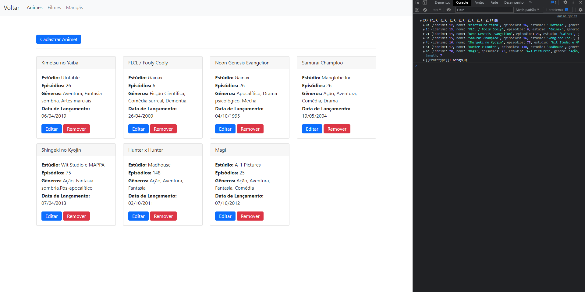

# Tokyo-3 MAX
Trabalho da disciplina Desenvolvimento de Sistemas Distribuídos 8º Semestre - Ciência da Computação  
O objetivo deste trabalho é criar um sistema distribuído com Banco de Dados, Front e Back-end (CRUD), portanto **Tokyo-3 MAX** nada mais é que um CRUD de Animes, Mangás e Filmes japoneses.

1. Banco de dados: MySql
2. Back-end: NodeJs
3. Front-end: HTML / CSS / JS / Bootstrap

Para rodar o Front-end utilizo a extensão do VSCode: **Live Server**